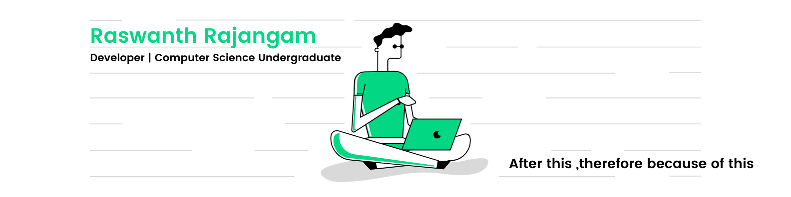

 

#### About me?
- :computer:  Web and Tech Enthusiast.
- :books:  UG Computer Science student.
- :raised_hands: I’m looking to collaborate on Front-End works and React applications.
- :memo: I’m currently learning Ds & Algo and API arch.  

#### How to reach me?
  

     

 

 
 

##### :star: from <a href="https://github.com/Raswanth8">Raswanth</a>
