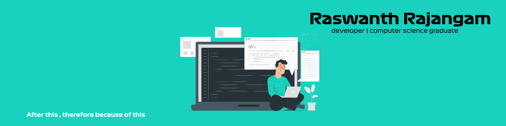

 

#### About me?
✅ I'm a CSE 2023 undergrad at Amrita University, Coimbatore
✅ I develop high performant web applications using React.js, and Material UI.
✅ Passionate about web 3.0 and Blockchain Technology.
✅ Student Researcher - (Blockchain, AI/ML, Distributed Technology)
✅ Familiar with Data Science, Machine Learning, and Computer Vision concepts
✅ Looking out for both Researcher and SDE part-time roles.

#### How to reach me?
  

    

 

##### :star: from <a href="https://github.com/Raswanth8">Raswanth</a>
